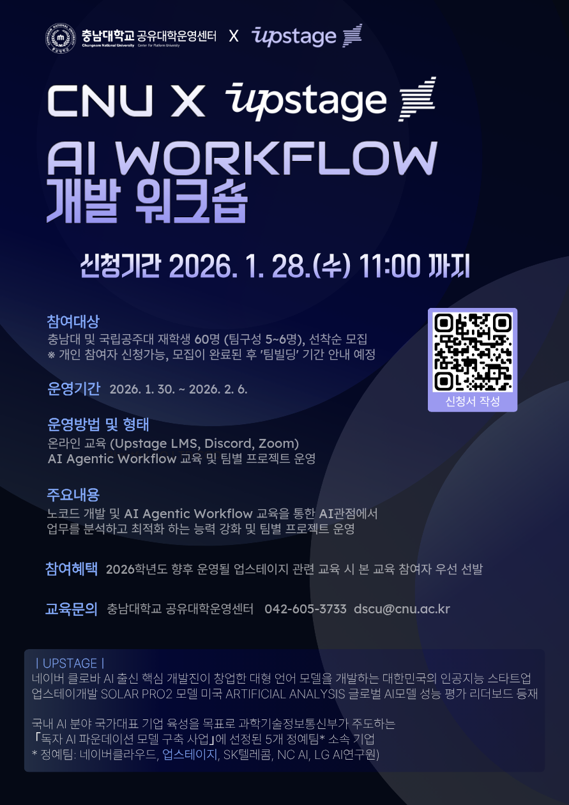
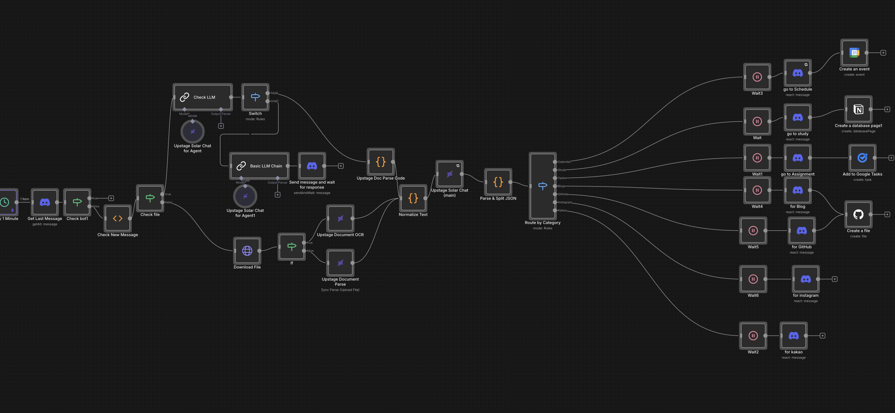

# 🧵 Tailor: AI Agentic Workflow
> **CNU(충남대학교) x Upstage AI WORKFLOW 개발 워크숍** 프로젝트

 

본 프로젝트는 **충남대학교 공유대학운영센터**와 **업스테이지(Upstage)**가 공동 주관한 워크숍의 결과물입니다. 업스테이지의 **SOLAR PRO** 모델과 **n8n**을 결합하여, 사용자의 비정형 데이터를 분석하고 최적화된 경로로 자동 처리하는 **AI 에이전트 시스템**을 구축했습니다.

---

## 🏫 프로그램 개요
* **프로그램명**: CNU X Upstage AI WORKFLOW 개발 워크숍
* **운영 기관**: 충남대학교 공유대학운영센터, Upstage (공동 주관)
* **운영 기간**: 2026. 1. 30. ~ 2026. 2. 6.
* **핵심 내용**: 노코드 개발 및 AI Agentic Workflow 교육을 통한 업무 분석 및 최적화

---

## 🌟 주요 기능 (Key Features)

### 1. 지능형 의도 분석 및 분류
* **Upstage Solar Pro**: 세계적 성능의 LLM을 활용해 텍스트의 맥락을 파악하고 의도를 분류합니다.
* **스마트 라우팅**: 일정, 학습, 할 일, 블로그 등 성격에 맞는 플랫폼으로 데이터를 자동 전송합니다.

### 2. 강력한 문서 이해 (Document AI)
* **Upstage OCR & Layout Analysis**: 이미지나 PDF 문서의 구조를 분석하여 텍스트를 정밀하게 추출합니다.
* **자동 요약**: 추출된 정보를 바탕으로 핵심 내용을 요약하여 데이터베이스에 저장합니다.

### 3. 멀티 플랫폼 통합 자동화
* **n8n 기반 설계**: Discord를 인터페이스로 사용하여 Notion, GitHub, Google Calendar 등과 유기적으로 연동됩니다.

---

## 🛠 기술 스택 (Tech Stack)
| 구분 | 사용 기술 |
| :--- | :--- |
| **AI Engine** | Upstage SOLAR PRO, Document Parse, OCR |
| **Automation** | n8n |
| **Interface** | Discord |
| **Integrations** | Notion, GitHub, Google Calendar, Google Tasks |

---

##  코드 구조 및 확인 방법

이 프로젝트의 모든 로직은 아래 경로에서 확인하실 수 있습니다.

### 1. 전체 워크플로우 (n8n JSON)
* [tailor_workflow.json](./workflow/tailor_workflow.json)
  * n8n에서 `Import from File`로 불러오면 전체 노드 구조와 연결 상태를 즉시 확인할 수 있습니다.

### 2. 주요 JavaScript 로직
AI의 분석 효율을 높이기 위해 직접 작성한 커스텀 스크립트입니다.
* [텍스트 정제 스크립트](./scripts/normalize-text.js): 데이터 노이즈 제거 및 포맷팅
* [응답 파싱 스크립트](./scripts/parse-ai-response.js): LLM의 JSON 응답을 안정적으로 추출

### 3. 워크플로우 시각화

---

## 💡 기대 효과 및 성과
* **AI 관점의 업무 최적화**: 단순히 도구를 쓰는 것을 넘어, AI가 업무를 분석하고 판단하는 에이전틱 워크플로우를 구현했습니다.
* **기술 검증**: 글로벌 AI 모델 성능 평가 리더보드에 등재된 Upstage의 기술력을 실전 프로젝트에 적용했습니다.

---

## 🧐 아쉬운 점 및 개선 과제 (Limitations)

### 1. 실시간성 및 중복 방지 로직의 한계
* 현재 1분 간격의 스케줄러(Schedule Trigger)를 통해 메시지를 감시하고 있어 실시간 대응에 약간의 지연이 발생할 수 있습니다.
* `Check New Message` 노드에서 메시지 ID를 통해 중복 실행을 방지하고 있으나, 대량의 데이터가 동시 유입될 시의 안정성 검증이 추가로 필요합니다.

### 2. 예외 처리 로직의 고도화
* LLM 응답이 JSON 형식을 벗어날 경우를 대비한 `Parse & Split JSON` 코드를 작성했으나, 모델의 창의적인(?) 응답에 따라 파싱 에러가 발생할 가능성이 여전히 존재합니다.
* 네트워크 장애나 API 할당량 초과 시의 재시도(Retry) 메커니즘이 일부 노드에만 적용되어 있어 전체적인 결함 허용(Fault Tolerance) 설계가 필요합니다.

---

## 🚀 나아가야 할 방향 (Future Roadmap)

### 1. 실시간 Webhook 전환
* 스케줄러 방식에서 디스코드 Webhook 또는 실시간 스트리밍 방식으로 전환하여 응답 속도를 즉각적으로 개선할 계획입니다.

### 2. 멀티 모달 에이전트 확장
* 현재의 OCR 및 문서 분석(Document Parse) 기능을 넘어, 이미지 내의 맥락까지 이해하고 분석하는 멀티 모달 기능을 강화할 예정입니다.

### 3. 개인화된 사용자 기억(Memory) 추가
* 이전 대화 맥락을 기억하는 메모리 기능을 도입하여, 단순 작업 분류를 넘어 사용자의 습관이나 선호도를 반영하는 맞춤형 비서로 고도화하고자 합니다.

### 4. 다양한 서비스 확장
* 현재 연동된 Notion, Google, GitHub 외에도 Slack, Trello, Jira 등 기업용 협업 도구와의 연동을 추가하여 활용 범위를 넓힐 계획입니다.

